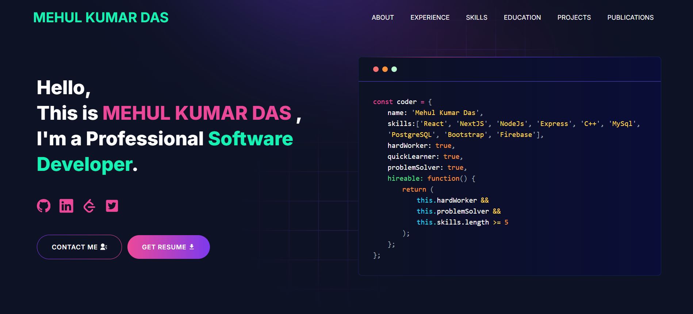

<p align="center" width="100%">
  
</p>

---

# Built Portfolio With GitHub

# Developer Portfolio

A professional, customizable portfolio website built with Next.js, Tailwind CSS, and modern React components.

---

## Demo



View the live preview here: https://portfolio-git-main-dasmehulkumars-projects.vercel.app/

---

## Sections

- Hero
- About
- Experience
- Skills
- Projects
- Education
- Blog
- Contact

---

## Installation

### Requirements

- Git
- Node.js

```bash
node --version
git --version
```

### Setup

```bash
npm install
npm run dev
```

Open http://localhost:3000

---

## Usage

Create a `.env` file in the project root and add the variables you need for the contact form and integrations:

```env
NEXT_PUBLIC_GTM=
NEXT_PUBLIC_APP_URL=
TELEGRAM_BOT_TOKEN=
TELEGRAM_CHAT_ID=
GMAIL_PASSKEY=
EMAIL_ADDRESS=
```

---

## Deployment

### Vercel

1. Sign in to Vercel.
2. Import this GitHub repository.
3. Add the required environment variables.
4. Deploy.

Vercel will automatically redeploy on every push to `main`.

---

## Tutorials

### Gmail App Password Setup

1. Enable 2-Step Verification in your Google account.
2. Open App Passwords.
3. Generate a 16-character app password and use it as `GMAIL_PASSKEY`.

### Create a Telegram Bot

1. Open Telegram and chat with `@BotFather`.
2. Create a new bot and copy the bot token.
3. Use the Telegram API to get your chat ID.

### Fetching Blog Posts from dev.to

Set your `devUsername` in the data file to display your blog posts in the portfolio.

---

## Packages Used

- @emailjs/browser
- @next/third-parties
- axios
- lottie-react
- next
- nodemailer
- react
- react-dom
- react-fast-marquee
- react-icons
- react-toastify
- sharp
- sass
- tailwindcss

---

## Contributing

Contributions are welcome.

---

## License

This project is open-source and free to use for learning and personal projects.
